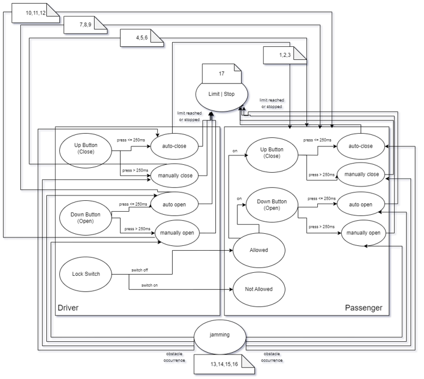
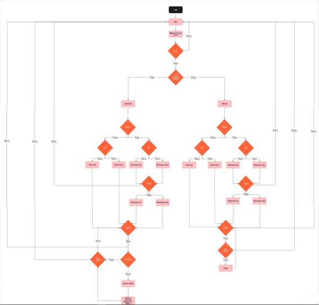

# Power Window Control System using Tiva C with FreeRTOS

## Table of Contents

- [Overview](#overview)
- [Features](#features)
- [Project Scope](#project-scope)
- [Hardware Requirements](#hardware-requirements)
- [Software Requirements](#software-requirements)
- [Implementation Details](#implementation-details)
- [Finite State Machine](#finite-state-machine)
- [Testing and Validation](#testing-and-validation)
- [System Architecture](#system-architecture)
- [Contributors](#contributors)
- [Acknowledgements](#acknowledgements)
- [License](#license)

## Overview

This project implements a power window control system for a front passenger door using Tiva C microcontroller running FreeRTOS. It provides manual open/close, one-touch auto open/close, window lock, and jam protection functionalities.

## Features

- **Manual Open/Close:** Allows continuous operation of the window by holding the switch.
- **One Touch Auto Open/Close:** Fully opens or closes the window with a short press of the switch.
- **Window Lock:** Disables other windows except the driver's window for safety.
- **Jam Protection:** Stops and reverses the window if an obstacle is detected during auto close.

## Project Scope

The scope includes:
- Implementing control panels for both passenger and driver sides.
- Using limit switches to prevent motor operation beyond window limits.
- Implementing obstacle detection using push buttons.

## Hardware Requirements

1. Tiva C microcontroller
2. Top and bottom limit switches
3. DC motor for window operation
4. Push buttons for window control
5. ON/OFF switch for window lock

## Software Requirements

- FreeRTOS for task scheduling and management
- Finite State Machine for control logic
- Simulink State Machine model for design verification

## Implementation Details

The system uses a Finite State Machine (FSM) to manage window states and transitions based on user inputs and sensor feedback.

### Finite State Machine

### Circute Topology

## Testing and Validation

- **Test Cases:** Includes various scenarios like simultaneous button presses and obstacle detection during auto close.
- **Validation:** Ensures correct behavior under normal and edge conditions.

## System Architecture

- **Circuit Topology:** Describes the layout of components and their connections.
- **System Flowchart:** Illustrates the flow of operations within the system.
- **State Diagram:** Visualizes the states and transitions of the FSM.

